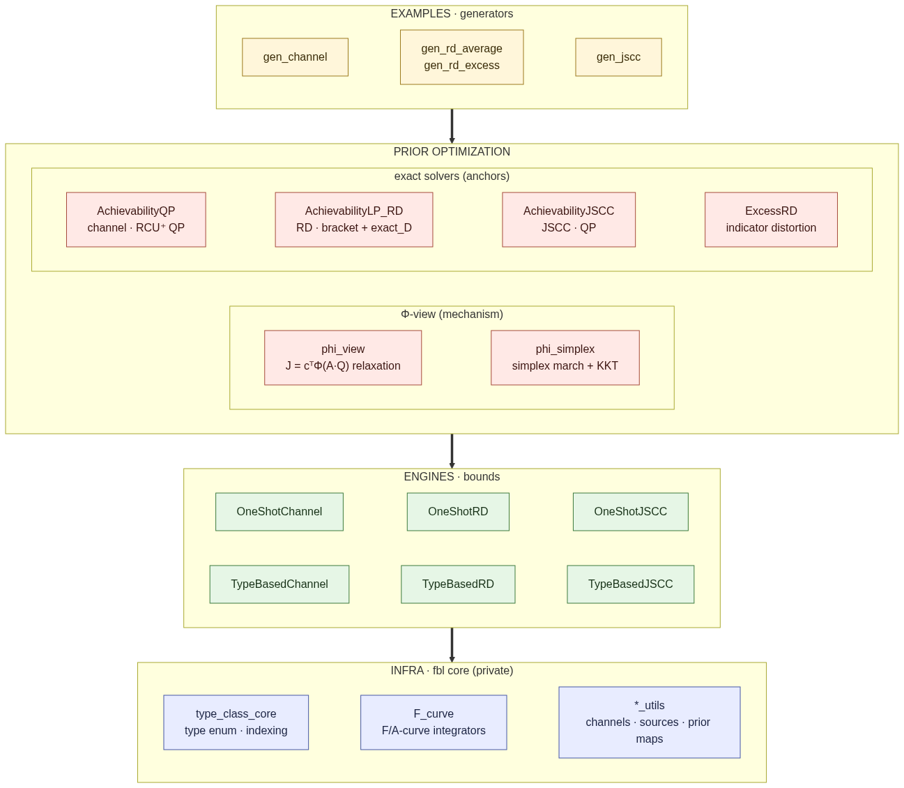
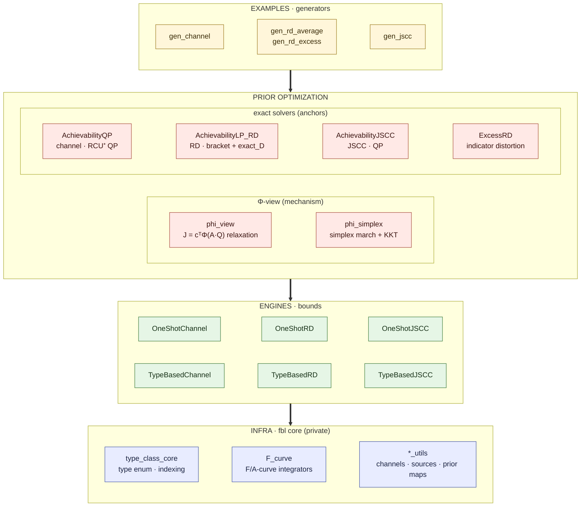
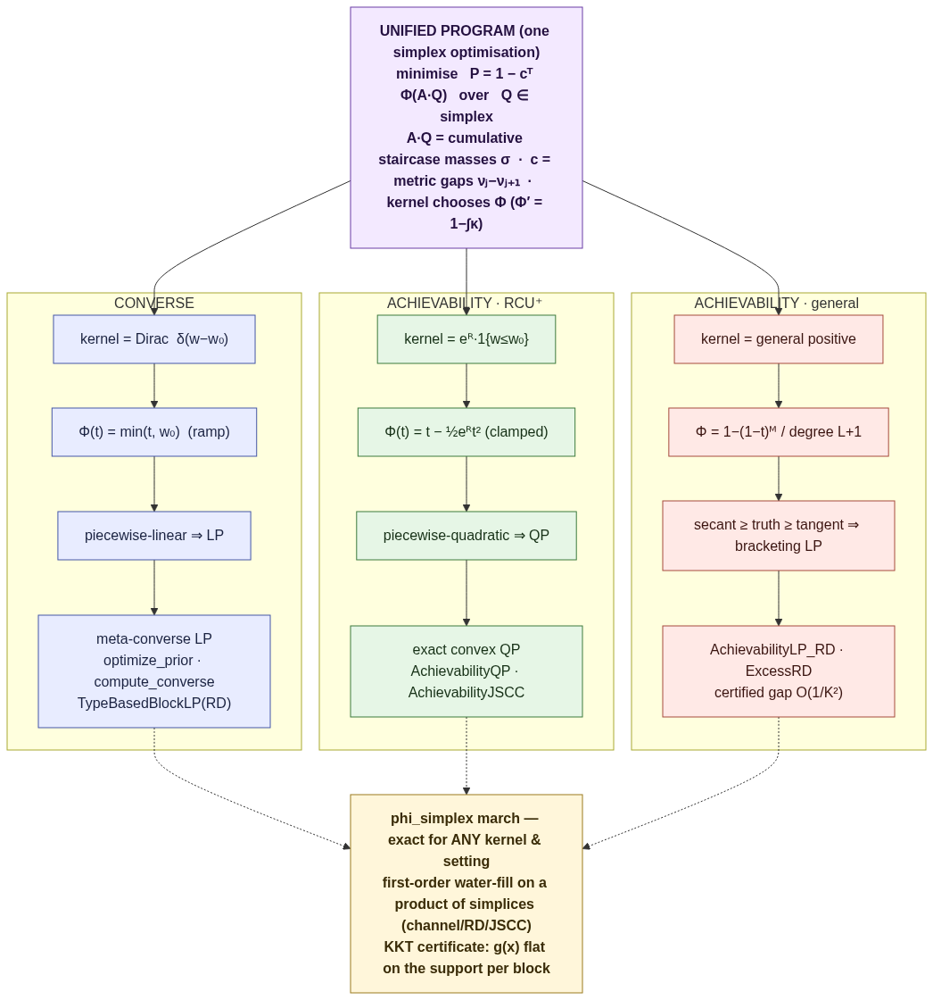
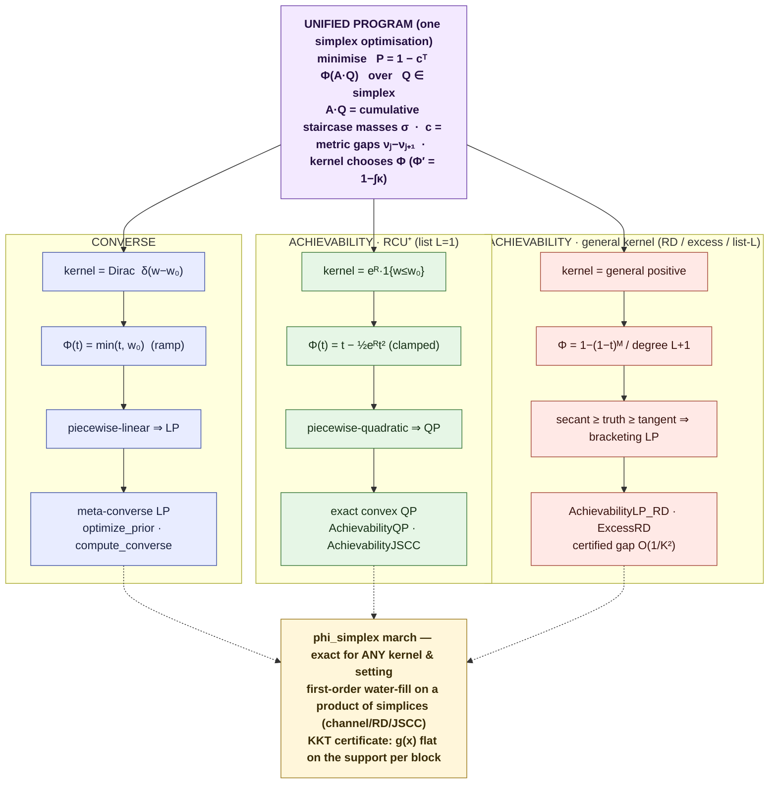

# Architecture & Library Specification

`fbl` is organised as a small dependency DAG: infra → engines → prior-opt →
examples. Three information-theoretic **settings** (channel / RD / JSCC) appear in
parallel throughout, in two implementation **flavours** (one-shot / type-based).

> **Companion docs:** [THEORY](docs/THEORY.md) (the framework and why each kernel
> gives a QP/LP/bracket) · [API](docs/API.md) (every public class & method) ·
> [TESTING](docs/TESTING.md) (what each cross-check guarantees).

## The library at a glance

The dependency DAG is four layers — **infra → engines → prior-opt → examples** —
with the three settings (channel / RD / JSCC) running in parallel through each.
The achievable bound of every setting is integrated against a *kernel*; the
prior-opt layer is the contribution, splitting cleanly into a **converse LP** and
an **achievability** exact convex program.



<details><summary>Mermaid source (renders on GitHub; <code>python docs/render_diagram.py</code> regenerates the PNG)</summary>


</details>

The same DAG as a text tree:

```
  examples/                         figure generators (reduced settings)
      ▲
  fbl.prioropt                      PRIOR OPTIMIZATION
      phi_view                      the relaxation J = cᵀΦ(A·Q) (Φ/Φ′/κ + evaluators)
      phi_simplex                   the achievability optimizer: simplex march + KKT
      AchievabilityQP/LP_RD/JSCC    exact QP / bracket solvers (validation anchors + _blocks)
      ExcessRD                      excess-distortion (indicator-distortion wrapper)
      ▲
  fbl  (engines)                    BOUNDS
      OneShot{Channel,RD,JSCC}      exact, lifted |X|^n, + Monte-Carlo
      TypeBased{Channel,RD,JSCC}    method of types, poly-n
      ▲
  fbl  (core, private)              INFRA
      type_class_core               type enumeration / sizes / indexing
      F_curve                       F/A-curve integrators (exact + surrogate kernels)
      channel_achievable_utils      BSC / BEC / Z factories, kronecker_power
      achievable_utils              BMS source, Hamming distortion
      type_based_utils              prior converters (memoryless ↔ type ↔ sequence)
```

## 1. The permutation

| | one-shot | type-based |
|---|---|---|
| **channel** | `OneShotChannel` | `TypeBasedChannel` |
| **rate-distortion** | `OneShotRD` | `TypeBasedRD` |
| **JSCC** | `OneShotJSCC` | `TypeBasedJSCC` |

Each engine exposes: `compute_curve(prior)` → error/distortion spectrum;
`theory(curve, M)` → the bound; `optimize_prior(M)` → the (converse) LP-optimal
prior; and — one-shot only — `draw_random_code` / `evaluate` / `mc` for the
Monte-Carlo cross-check.

## 2. Bounds, converse, and prior optimization

For each setting there are three quantities:

- **achievable** — the random-coding bound (`theory`, or the exact program below);
- **converse** — the meta-converse LP (`optimize_prior` / `compute_converse`);
- **Monte-Carlo** — realised error of drawn codebooks (one-shot only).

The converse already optimises the prior point-wise (one threshold). The
**achievability** bound is a kernel integral of the whole spectrum, so its prior
optimisation is global — and is an **exact convex program**:

| setting | kernel | program | class |
|---|---|---|---|
| channel / JSCC | RCU⁺ (L=1) | exact convex **QP** | `AchievabilityQP`, `AchievabilityJSCC` |
| any positive kernel (incl. RD) | general | **bracketing LP** (secant ≥ truth ≥ tangent) | `*.solve_bracketing_lp` |

The converse is the achievability program with the **Dirac kernel** — used as a
built-in self-check (`AchievabilityJSCC.solve_dirac_ramp` ≡ `compute_converse`).

### 2.1 The unified `Φ`-view and the direct simplex program

Converse and achievability are **the same program**, distinguished only by the
kernel that picks `Φ`. This is the conceptual centre of the library:



<details><summary>Mermaid source</summary>


</details>

All of the above are one program, `minimize 1 − cᵀ Φ(A·Q)` over the simplex, where
`A·Q` are the cumulative staircase masses, `c` the metric gaps, and the **kernel
chooses `Φ`** (`Φ' = 1 − g`, `g = ∫κ`):

| program | kernel | `Φ(t)` | shape |
|---|---|---|---|
| converse | Dirac `δ(w−w₀)` | `min(t, w₀)` (ramp) | piecewise-linear → **LP** |
| RCU⁺ (L=1) | `e^R 1{w≤w₀}` | `t − ½e^R t²` clamped | piecewise-quadratic → **QP** |
| list-L / RD | — | degree `L+1` / `1−(1−t)^M` | → LP / bracket |

`phi_simplex` (`fbl.prioropt.phi_simplex`) solves this **directly on the simplex**
by a first-order march (projected gradient / Frank–Wolfe) using the analytic
water-fill gradient `g(x) = ∂Γ/∂Q(x) = Aᵀ(c ⊙ Φ′(A·Q))`; optimality is the
**water-filling** KKT condition (`g(x)` flat on the support, dominated off it),
verified intrinsically by `check_kkt`. The prior obeys a **product of simplices**
(`simplex_blocks`): one global simplex for channel/RD, one per source-type block
for JSCC — so projection and the KKT certificate are per-block. It is exact for
*any* kernel and *any* setting (no bracketing gap), cvxpy-free, and warm-startable
across a sweep. `phi_view` (`fbl.prioropt.phi_view`) is the relaxation it sits on
(the potentials Φ/Φ′/κ, the literal `(A,c)` preprocess, and the type-based
evaluators `J_typebased_{channel,rd,jscc}`), validated against Monte-Carlo /
one-shot.

**Solver choice.**

| task | march (`phi_simplex`) | exact anchor |
|---|---|---|
| achievability, RCU⁺ (channel/JSCC) | **default** — fast, warm-startable, KKT-certified | `AchievabilityQP` / `AchievabilityJSCC.solve_rcu_plus` (validation) |
| achievability, general kernel (RD exact/smooth) | **default** — exact (true `Φ`, no bracket gap) | `AchievabilityLP_RD.solve_bracketing_lp` (validation reference) |
| converse | — | **meta-converse LP** (`optimize_prior` / `compute_converse`) |

The march is the production optimizer for every setting/kernel; the QP/bracketing-LP
remain as exact validation anchors (and supply the `_blocks` staircase the march
reads). First-order convergence is fast to engineering accuracy; an active-set
finish (future work) would reach machine precision on the flat clamp region.

## 3. Conventions (read before comparing curves)

- **Rate / `M`.** Channel has a free rate knob `M = e^{nR}` (per-symbol
  `M₁ = e^R`). JSCC has **no free knob**: you resolve the whole source, so for
  list size `L=1` the codebook is pinned to `M = |V|^n` (rate-lowering levers are
  the list size and the source entropy). RD uses `M` reproduction candidates.
- **Kernel consistency.** The QP optimises the **RCU⁺** bound; compare it against a
  memoryless prior scored with the **same** RCU⁺ kernel
  (`fbl.prioropt.rcu_plus_from_F_curve`, threshold `1/M`), **not** the exact-RC
  `theory` (a different, tighter bound). Mixing kernels breaks the
  `optimal ≤ memoryless` ordering.
- **Standard memoryless baseline — `memoryless_optimal(M)`.** Defined as *the
  optimal single-letter prior (exact n=1 program) applied i.i.d.* It is fast
  (constant in `n`), exact, and the i.i.d. extension is a feasible point of the
  n-letter program, so `QP@n ≤ memoryless_optimal@n` holds **by construction**.

## 4. Validation strategy

No closed-form oracle exists in general, so every bound is cross-checked
(`tests/`):

1. **one-shot ↔ type-based** agreement at small `n` (F/A-curves and the LP optimum);
2. **RCU expectation ↔ Monte-Carlo** mean of random codebooks;
3. **converse ≤ achievable** at every rate;
4. **prior-opt program ↔ invariants**: exact QP ≤ best memoryless; bracketing LP
   straddles the exact bound at its own optimum (`P_lo ≤ P ≤ P_hi`); Dirac program
   ≡ meta-converse LP.

## 5. Known ceilings

- **Type-based** is polynomial in `n` but the **cvxpy build** of the QP/LP grows
  with the staircase row count; practical to `n ≈ 12–20` before constraint
  assembly (not the solve) dominates. Vectorising the per-knot constraint build is
  the route to larger `n`.
- **Bracketing LP** mesh `K` trades the certified gap (`O(1/K²)`) against build
  cost; `K ≈ 20–48` is plenty.
- **One-shot / Monte-Carlo** is exponential in `n` (`|X|^n`); practical to
  `n ≈ 10–12`.

## 6. A note on the headline findings

- **Channel.** The achievability prior gain over optimised memoryless is a
  **low-rate + large-`n` corner** effect (constant-composition): small at `n=6`,
  large (tens of %) by `n=20` at low rate.
- **JSCC.** For an i.i.d. source + memoryless channel the gain is **negligible**
  at small `n` — the optimal ensemble is essentially memoryless. See
  `examples/ex5_jscc_gain.py`.
