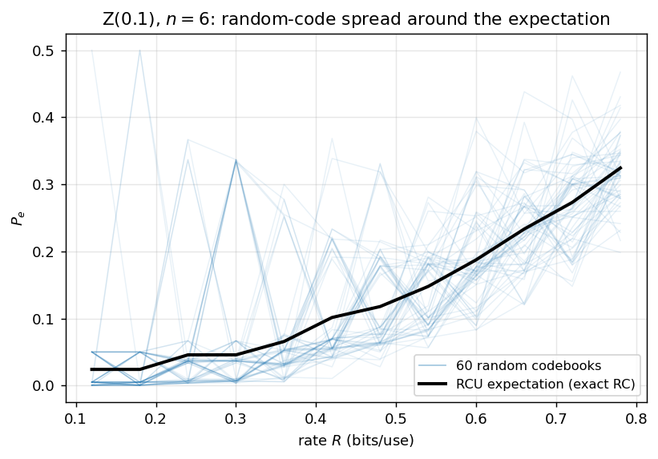
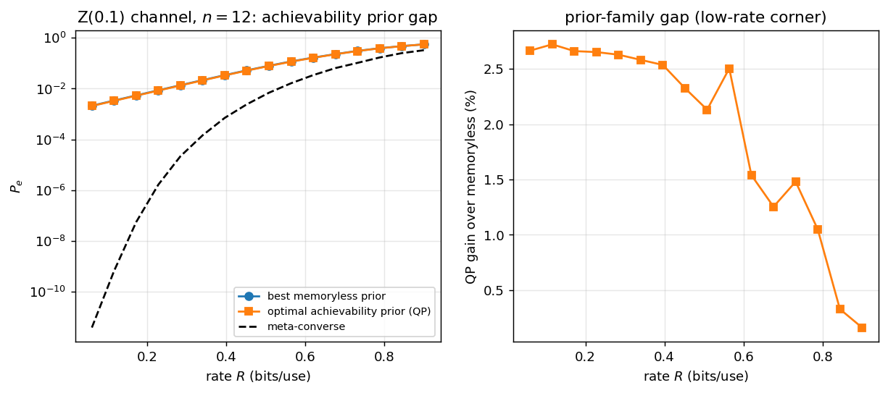
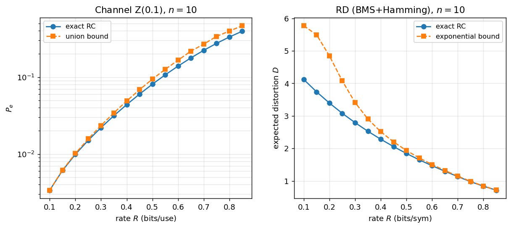
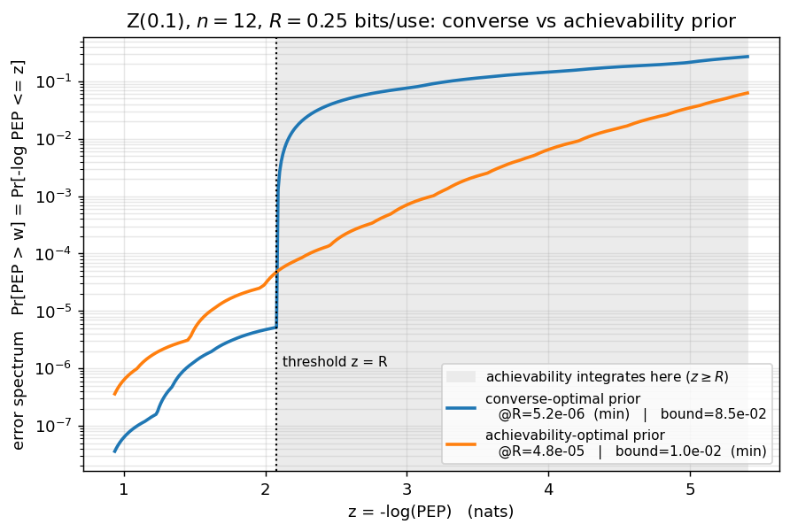
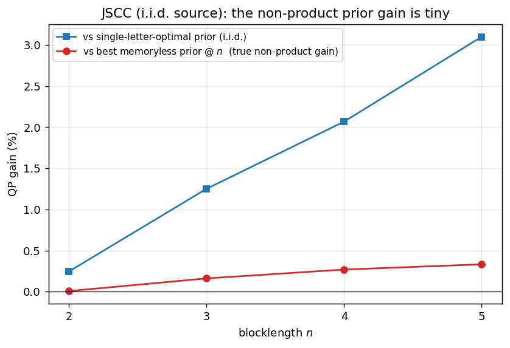

# Results

Headline figures and numbers produced by [`examples/generate_all.py`](examples/)
(reduced, fast settings — representative, not thesis-resolution). Every bound is
backed by the cross-check suite in [`tests/`](tests/) (**64 tests passing**:
52 engine cross-checks + 12 prior-optimization invariants).

Regenerate everything with:

```bash
pip install -e ".[plots,test]"
python examples/generate_all.py     # -> examples/figures/*.png
pytest -q                           # 64 tests
```

---

## G1 — Monte-Carlo spread around the RCU expectation (channel)



The achievable bound is an *expectation* over the random-coding ensemble. 60
actual codebooks (drawn in the lifted `X^6` space, exact ML decoding) scatter
around the analytic RCU expectation — a single random code can deviate
materially from the mean at finite `n`. *(Z(0.1), n=6.)*

---

## G2 — the prior gap, with the true achievability optimum (channel)



The distinguishing figure: the **exact achievability-optimal prior** (QP, over all
type priors) vs the **best memoryless prior**, against the meta-converse, at
`n=12`. The QP gain over the best memoryless prior peaks at **≈2.7 % at low rate**
and decays to ~0 at high rate — the **low-rate corner** of the constant-composition
effect. (At `n=20` this corner reaches tens of %; here `n` is reduced for speed.)
The QP is, as it must be, never below the meta-converse.

---

## G3 — exact random-coding bound vs the closed-form surrogate (channel & RD)



The exact random-coding kernel vs the common closed-form replacements — the
**union bound** (channel) and the **exponential bound** (rate-distortion). Both
surrogates are loose at low rate and tighten as the rate grows. *(n=10.)*

---

## Error spectrum — converse-optimal vs achievability-optimal prior



The error spectrum `Pr[PEP > w] = Pr[-log PEP <= z]` (log scale, vs `z = -log PEP`)
for the two optimal priors, at a fixed rate. The two bounds optimise the prior for
*different* objectives, and it shows:

- the **converse-optimal prior** dips to its minimum **exactly at the threshold
  `z = R`** (the meta-converse is a single-threshold objective) and then **blows up
  across `z > R`** — it pays nothing for the tail;
- the **achievability-optimal prior** sits a hair higher at `z = R` but stays
  **orders of magnitude lower across the whole `z >= R` region** — precisely
  because the achievability bound *integrates* the spectrum there (weighted by
  `e^{-Lz}`).

Each prior carries **two** numbers (both shown in the legend): its single-threshold
value `@R` and the integrated achievability bound. They cross:

| prior | `@R` (single threshold) | achievability bound (∫ over `z>=R`) |
|---|---|---|
| converse-optimal | **5.2e-6** (min) | 8.5e-2 |
| achievability-optimal | 4.8e-5 | **1.0e-2** (min) |

The converse-optimal prior wins at the threshold but, **reused for achievability,
gives an 8.5 % error bound — 8.5× worse** than the achievability-optimal prior's
1.0 % — precisely because it ignores the `z > R` tail. That penalty is the
practical reason to optimise the prior for the right objective. *(Z(0.1), n=12,
R=0.25 bits/use.)*

---

## JSCC — the non-product prior gain is tiny



For an i.i.d. source through a memoryless channel, the exact full-type-prior QP
optimum buys almost nothing over the **best memoryless prior at blocklength `n`**:
the genuine non-product gain (red) stays **well under 1 % through n=5**. The larger
gain vs the *single-letter-optimal* prior applied i.i.d. (blue, ≈3 % at n=5) is
mostly a **within-memoryless** effect — the n=1-optimal prior is itself suboptimal
as a memoryless prior at larger `n` — not a non-product effect. This is the JSCC
counterpart of the channel's G2 result, and it is essentially null: the source
structure already lives in the metric, so a memoryless conditional law captures it.

| `n` | QP | best memoryless@`n` | non-product gain |
|----:|----:|----:|----:|
| 2 | 0.37735 | 0.37738 | 0.008 % |
| 3 | 0.36581 | 0.36640 | 0.162 % |
| 4 | 0.36026 | 0.36123 | 0.269 % |
| 5 | 0.35994 | 0.36114 | 0.333 % |

---

## Validation summary

| check | where | result |
|---|---|---|
| one-shot ↔ type-based (F/A-curves, LP) | `tests/test_type_based_*` | exact to fp |
| RCU expectation ↔ Monte-Carlo mean | `tests/test_jscc_one_shot`, `ex1` | agree |
| converse ≤ achievable | `tests/test_prioropt` | holds |
| exact QP ≤ best memoryless (RCU⁺ kernel) | `tests/test_prioropt` | holds |
| bracketing LP straddles exact (`P_lo ≤ P ≤ P_hi`) | `tests/test_prioropt` | holds |
| Dirac-kernel program ≡ meta-converse LP | `tests/test_prioropt` | ~1e-9 |

See [`ARCHITECTURE.md`](ARCHITECTURE.md) for the conventions (rate/`M` semantics,
RCU⁺-vs-exact kernel, the `memoryless_optimal` baseline) that make these
comparisons apples-to-apples.
