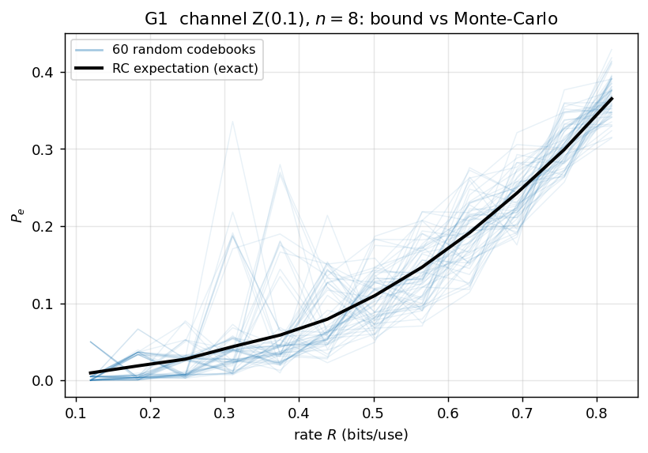
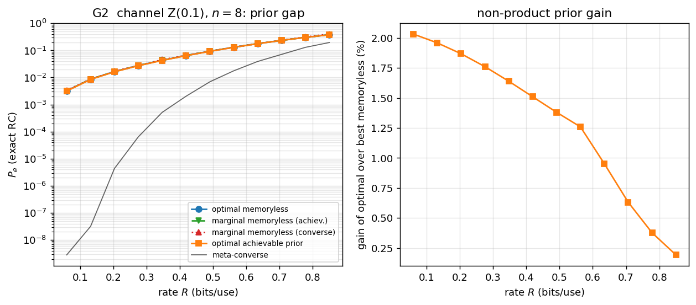
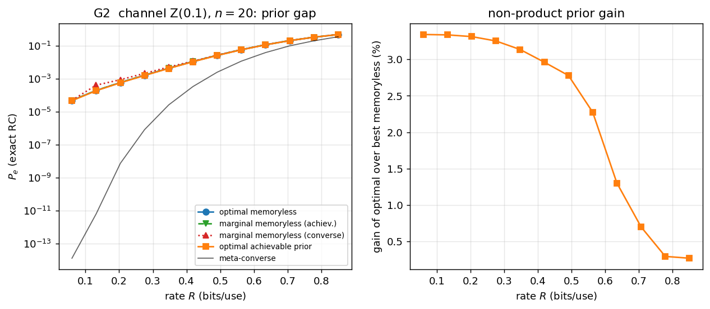
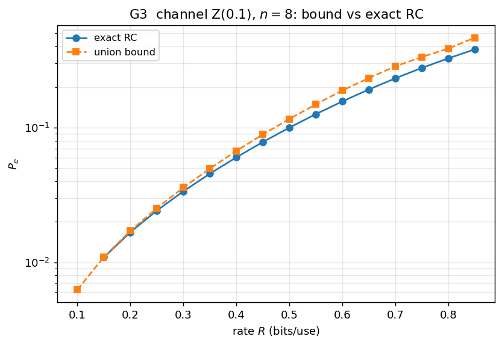
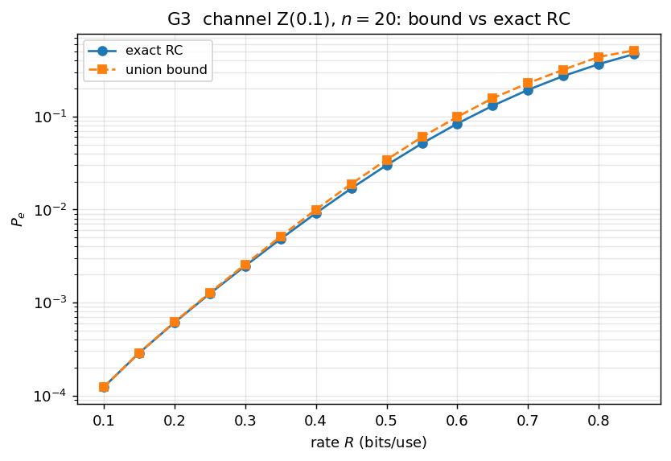
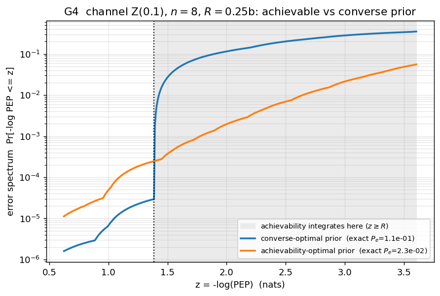
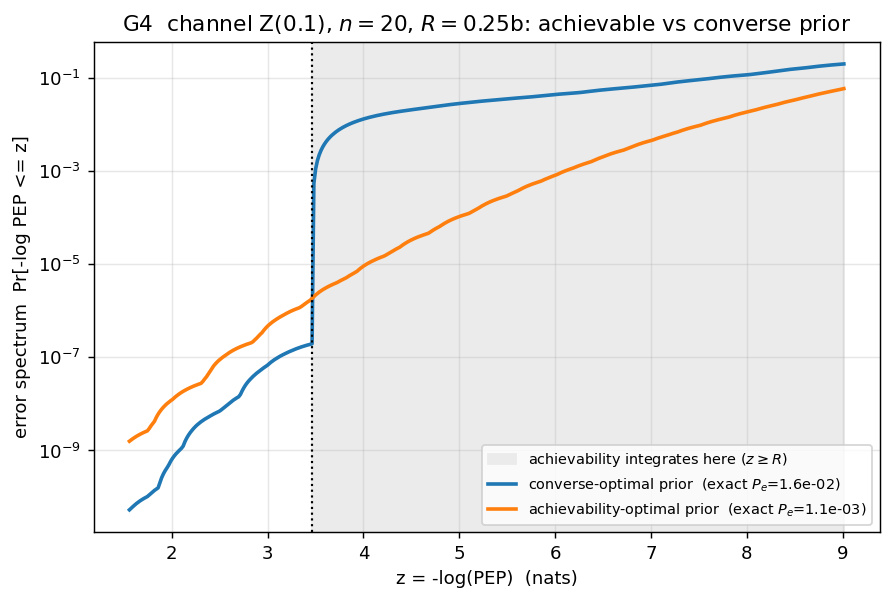

# Channel coding — results

Pinned case: **Z-channel, crossover 0.1**. G1 validates the bound at `n=8`; the
result figures (G2–G4) are shown at **`n=8` and `n=20`**. The achievability-optimal
prior is the Φ-view simplex march (KKT/FW-gap certified); the bound is the **exact**
random-coding kernel. Generated by [`examples/gen_channel.py`](../examples/gen_channel.py).

## G1 — bound vs Monte-Carlo (`n=8`)

60 random codebooks (lifted `X⁸`, exact ML decoding) scatter around the analytic
random-coding expectation — the bound is the mean realised error. This validates
the bound; the result figures then trust it and push to `n=20` via the type-based
representation (no lifted MC needed).

## G2 — the prior gap (centerpiece)

| | `n=8` | `n=20` |
|---|---|---|
| |  |  |

The exact achievability-optimal prior vs three memoryless baselines, all scored
with the **same exact kernel**: the best **optimal memoryless** prior, and the
**marginal-memoryless** priors (the per-symbol marginal of the optimal achievable
and of the converse prior, applied i.i.d. — the classical error-exponent recipe).

The non-product gain (optimal vs best memoryless) peaks at low rate and **grows
with `n`: ≈2.0 % at `n=8`, ≈3.3 % at `n=20`** (the constant-composition corner).
The marginal-memoryless priors nearly coincide with the best memoryless — except
the **converse**-marginal, which lags at low rate / large `n`. Takeaway: for this
channel the memoryless prior is *nearly* optimal, and we can now say so
**rigorously** (the optimum is KKT-certified), not heuristically.

## G3 — exact RC vs the union bound

| `n=8` | `n=20` |
|---|---|
|  |  |

The exact random-coding error vs the union-bound surrogate; loose at low rate,
tightening as the rate grows.

## G4 — error spectrum: achievability- vs converse-optimal prior

| `n=8` | `n=20` |
|---|---|
|  |  |

The error spectrum `Pr[-log PEP ≤ z]` for the two optimal priors. The
converse-optimal prior is best *at* the threshold but abandons the `z>R` tail the
achievability bound integrates, so **reused for achievability it is far worse**:

| | converse-opt prior, exact `P_e` | achievability-opt prior, exact `P_e` | penalty |
|---|---|---|---|
| `n=8`  | 1.15e-1 | 2.28e-2 | **5×** |
| `n=20` | 1.62e-2 | 1.09e-3 | **15×** |

The penalty grows with `n` — the concrete reason the converse and achievability
prior optimizations are genuinely different problems.
