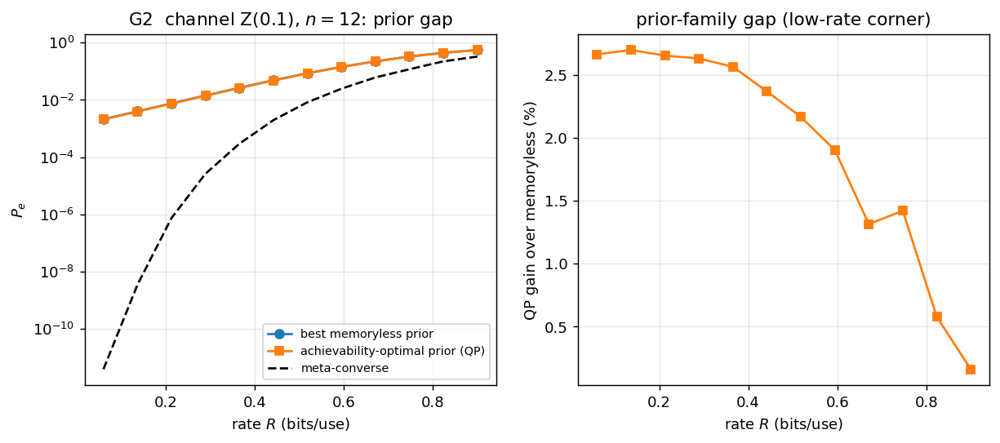
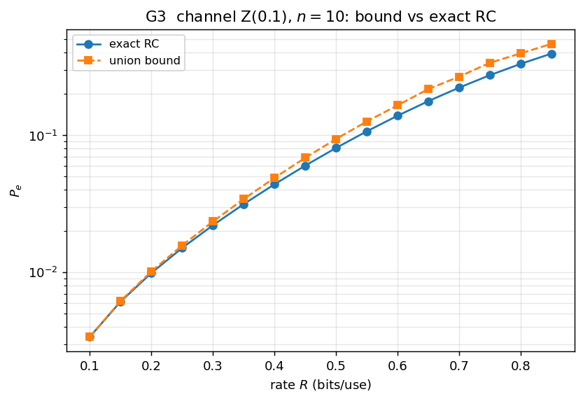
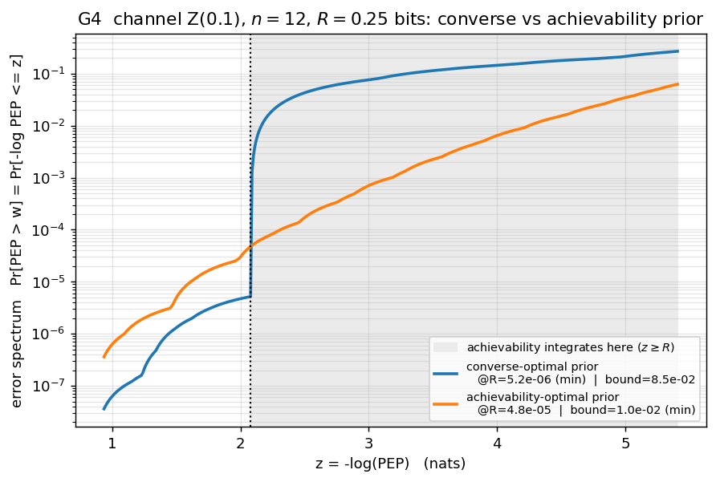
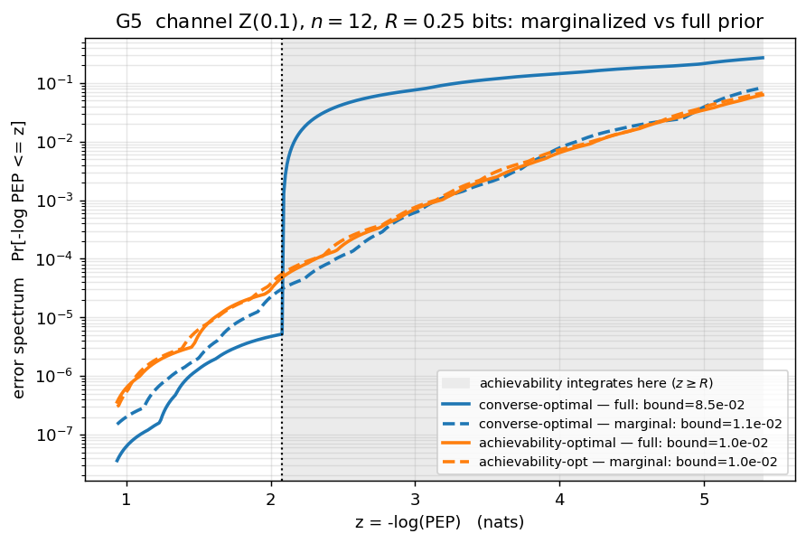

# Channel coding — results

Four finite-blocklength figures for the channel Z(0.1), generated by
[`examples/gen_channel.py`](../examples/gen_channel.py) (reduced, fast settings).

## G1 — Monte-Carlo spread vs the RCU expectation

60 random codebooks (lifted `X^6` space, exact ML decoding) scatter around the
analytic RCU expectation — a single random code deviates materially from the mean
at finite `n`.

## G2 — the prior gap

The exact achievability-optimal prior (QP over all type priors) vs the best
memoryless prior, against the meta-converse, at `n=12`. The QP gain over the best
memoryless prior peaks at **≈2.7 % at low rate** and decays to ~0 at high rate —
the **low-rate corner** of the constant-composition effect (it reaches tens of %
at `n=20`).

## G3 — exact RC vs the union bound

The exact random-coding error vs the union-bound surrogate; the bound is loose at
low rate and tightens as the rate grows.

## G4 — error spectrum: converse- vs achievability-optimal prior

The error spectrum `Pr[PEP > w] = Pr[-log PEP <= z]` (log scale, vs `z`) for the
two optimal priors. The legend carries **both** numbers for each prior — the
single-threshold value `@R` and the integrated achievability bound — and they
cross:

| prior | `@R` (single threshold) | achievability bound (∫ over `z>=R`) |
|---|---|---|
| converse-optimal | **5.2e-6** (min) | 8.5e-2 |
| achievability-optimal | 4.8e-5 | **1.0e-2** (min) |

The converse-optimal prior is best *at* the threshold but, **reused for
achievability, gives an 8.5 % error bound — 8.5× worse** than the
achievability-optimal prior's 1.0 % — because it abandons the `z > R` tail that
the achievability bound integrates. This 8.5× penalty is the concrete reason the
converse and achievability prior optimizations are different problems.

## G5 — marginalize: the per-symbol marginal as a memoryless prior

The classical error-exponent recipe for a memoryless prior is to take the
**per-symbol marginal** of a general prior and apply it i.i.d. Because the optimal
type prior is exchangeable (uniform within each type class), the marginal is
well-defined. G5 overlays each optimal prior's error spectrum (solid) against its
marginalized i.i.d. version (dashed):

| prior | full | marginalized i.i.d. |
|---|---|---|
| converse-optimal | 8.5e-2 | **1.1e-2** (≈8× better) |
| achievability-optimal | 1.0e-2 | 1.0e-2 (+2.7 %) |

Two things stand out. The **achievability-optimal prior's marginal is essentially
optimal** — at `n=12` the full type-prior optimum is already nearly i.i.d., so
marginalizing costs ~3 %. And the **converse-optimal prior, which is 8.5× too weak
when reused directly for achievability, becomes good once marginalized**: the
sharp single-threshold step (solid blue) is washed out into the smooth dashed
curve, recovering an ~8× better achievability bound. Marginalization discards
exactly the non-product structure that the converse prior over-fit to the single
threshold.
