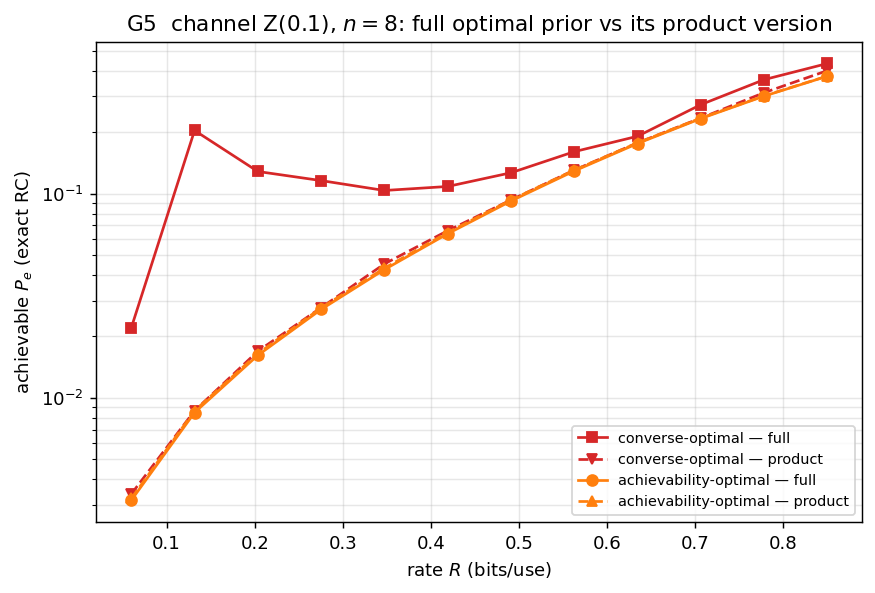
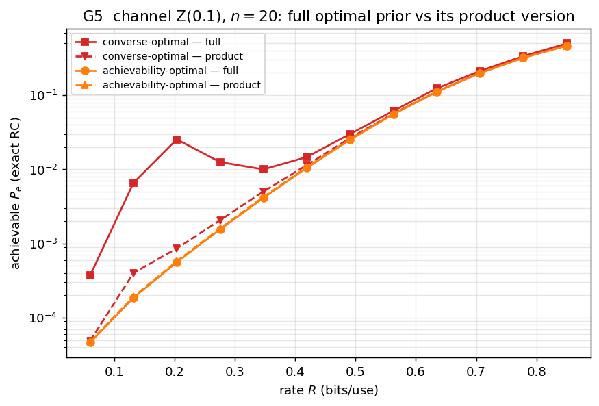
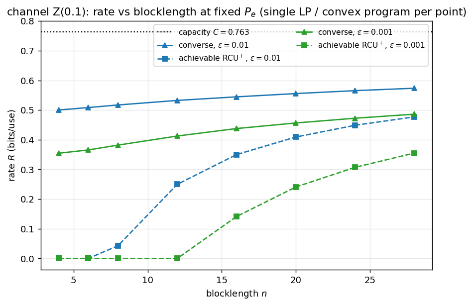

# Channel coding — results

Pinned case: **Z-channel, crossover 0.1**. G1 validates the bound at `n=8`; the
result figures (G2–G4) are shown at **`n=8` and `n=20`**. The achievability-optimal
prior is the Φ-view simplex march (KKT/FW-gap certified); the bound is the **exact**
random-coding kernel. Generated by [`examples/gen_channel.py`](../examples/gen_channel.py).

## G1 — bound vs Monte-Carlo (`n=8`)

60 random codebooks (lifted `X⁸`, exact ML decoding) scatter around the analytic
random-coding expectation — the bound is the mean realised error. This validates
the bound; the result figures then trust it and push to `n=20` via the type-based
representation (no lifted MC needed).

## G2 — the prior gap (centerpiece)

| | `n=8` | `n=20` |
|---|---|---|
| |  |  |

The exact achievability-optimal prior vs three memoryless baselines, all scored
with the **same exact kernel**: the best **optimal memoryless** prior, and the
**marginal-memoryless** priors (the per-symbol marginal of the optimal achievable
and of the converse prior, applied i.i.d. — the classical error-exponent recipe).

The non-product gain (optimal vs best memoryless) peaks at low rate and **grows
with `n`: ≈2.0 % at `n=8`, ≈3.3 % at `n=20`** (the constant-composition corner).
The marginal-memoryless priors nearly coincide with the best memoryless — except
the **converse**-marginal, which lags at low rate / large `n`. Takeaway: for this
channel the memoryless prior is *nearly* optimal, and we can now say so
**rigorously** (the optimum is KKT-certified), not heuristically.

## G3 — exact RC vs the union bound

| `n=8` | `n=20` |
|---|---|
|  |  |

The exact random-coding error vs the union-bound surrogate; loose at low rate,
tightening as the rate grows.

## G4 — error spectrum: achievability- vs converse-optimal prior

| `n=8` | `n=20` |
|---|---|
|  |  |

The error spectrum `Pr[-log PEP ≤ z]` for the two optimal priors. The
converse-optimal prior is best *at* the threshold but abandons the `z>R` tail the
achievability bound integrates, so **reused for achievability it is far worse**:

| | converse-opt prior, exact `P_e` | achievability-opt prior, exact `P_e` | penalty |
|---|---|---|---|
| `n=8`  | 1.15e-1 | 2.28e-2 | **5×** |
| `n=20` | 1.62e-2 | 1.09e-3 | **15×** |

The penalty grows with `n` — the concrete reason the converse and achievability
prior optimizations are genuinely different problems.

## G5 — optimal prior vs its i.i.d. product (marginalization cost)

| `n=8` | `n=20` |
|---|---|
|  |  |

Replace the (KKT-certified) optimal achievable prior by its **product version** —
the per-symbol marginal applied i.i.d. — and see how the exact achievable bound
changes. Left: the two bounds nearly coincide; right: the **marginalization cost**
peaks at **≈3.5 % at low rate** (`n=20`) and decays to ~0 at high rate — the optimum
is already nearly i.i.d., so the non-product structure is worth only a few percent
(the constant-composition corner).

> The converse prior is intentionally omitted here: its single-threshold optimum is
> **non-unique** where the converse program is slack (low/mid rate, LP value ≈ 0),
> so "the" converse prior — and its achievable bound — is solver-dependent there
> and reusing it for the whole-spectrum integral is ill-posed. The achievable prior
> is unique and KKT-certified, so this comparison is well-defined.

## Rate vs blocklength at fixed error

The complementary view to G1–G5: **fix the error probability and plot the rate vs
blocklength**, here for **two targets `ε=10⁻²` and `ε=10⁻³`** (same color = same
`ε`; `▲` solid = converse, `■` dashed = achievable). The **converse** and
**achievable** rates bracket the true `ε`-capacity and both rise toward capacity
`C=0.763`; the looser `ε=10⁻²` pair sits higher and **noticeably tighter** — at
`n=28` the gap is ≈0.10 bits (`0.477` vs `0.574`) against ≈0.13 for `ε=10⁻³`
(`0.355` vs `0.486`) — you can afford more codewords at the same `n` when more error
is tolerated, and the achievable also lifts off `R=0` sooner (`n≈8` vs `n≈16`).
Crucially **each point is a single solve, not a rate sweep**:
- converse — one **LP** (`TypeBasedChannel.converse_rate_at_eps(ε)`): `min w` s.t.
  success `≥ 1−ε`, the ramp being PWL in `(σ,w)`;
- achievable — one **convex program** (`AchievabilityQP.achievable_rate_at_eps(ε)`):
  the RCU⁺ potential `σ−σ²/(2w)` is quad-over-linear in `w`, hence jointly concave,
  so `min w` s.t. success `≥ 1−ε` is convex (QP/SOCP).

Both are ~20× faster than rate-bisection and verified to match it. **How large can
`n` go?** Capped here at `n=28`: the single-solve removes the bisection factor but
not cvxpy's *compilation* ceiling — beyond `n≈30–40` the build explodes (tens of
thousands of constraints) and CLARABEL becomes unreliable. Vectorising the cvxpy
build is the route further; the pure-NumPy march scales past it (see the RD figure,
`n=80`). At small `n` the achievable is conservative — the genuine
finite-blocklength regime.
