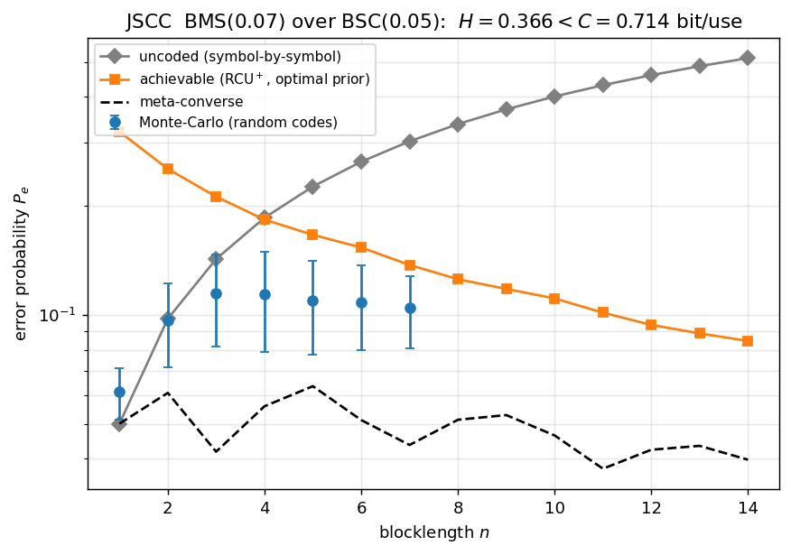

# Joint source-channel coding (JSCC) — results

Pinned case: source **BMS `P_V=[0.93,0.07]`** (entropy `H≈0.366` bit) transmitted
over a **`BSC(0.05)`** (capacity `C≈0.714` bit). Since **`H < C`** the source is
transmissible. For list size `L=1` the codebook is pinned to `M=|V|^n` (no free
rate knob), so the natural axis is the **blocklength `n`**. Generated by
[`examples/gen_jscc.py`](../examples/gen_jscc.py).

## Error probability vs blocklength

Four curves on one graph:

- **meta-converse** (lower bound, type-based) — the floor `P_e` of *any* code;
- **achievable (RCU⁺)** — the upper bound at the **Φ-view march** optimal
  conditional prior (the new prior-optimization mechanism, KKT-certified);
- **Monte-Carlo** — realised error of random JSCC codebooks (lifted `V^n`, exact
  MAP), feasible only at small `n`;
- **uncoded** — the symbol-by-symbol baseline (send `V` through the channel,
  per-symbol MAP), block error `1-(1-p)^n`.

The story: because `H < C`, the **coded** error *decreases* with `n` (achievable
bound `0.32 → 0.085`; Monte-Carlo sits below the bound, as it must), while the
**uncoded** error *increases* (`0.05 → 0.51`) — they cross around `n≈3–4`, after
which coding wins decisively. The Monte-Carlo points track the achievable bound
from below and validate it where they overlap.

> Prior optimization here uses the same generalized mechanism as channel/RD — the
> Φ-view simplex march, with the JSCC twist that the prior is a *conditional*
> codeword-type law (one simplex per source-type block, certified by a *block-wise*
> KKT condition). For an i.i.d. source the non-product prior gain is essentially
> nil (the optimal ensemble is already memoryless), so the achievable curve above
> is indistinguishable from the best-memoryless one — the value of the optimizer
> here is generality and the certificate, not a gain.
