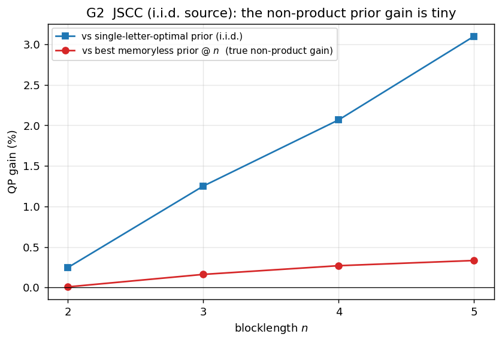

# Joint source-channel coding (JSCC) — results

One figure so far; the full G1/G3/G4 treatment is future work.

## G2 — the prior gap (a null result)

For an i.i.d. source through a memoryless channel (skewed BSS over Z(0.1)), the
exact full-type-prior QP optimum barely beats the **best memoryless prior at
blocklength `n`**: the genuine non-product gain (red) stays **well under 1 %
through n=5**. The larger gain vs the *single-letter-optimal* prior applied
i.i.d. (blue, ≈3 % at n=5) is mostly a **within-memoryless** effect — the
n=1-optimal prior is itself suboptimal as a memoryless prior at larger `n` — not a
non-product effect. The source structure already lives in the metric
`m = |V| W(y|x) P_V(v)`, so a memoryless conditional law captures it.

## To do

- G1 Monte-Carlo spread (one-shot JSCC MC vs the RCB expectation);
- G3 there is no exact-vs-bound pair for JSCC (only the RCU⁺ kernel) — state the
  asymmetry;
- G4 error spectrum of the converse- vs achievability-optimal conditional prior.
