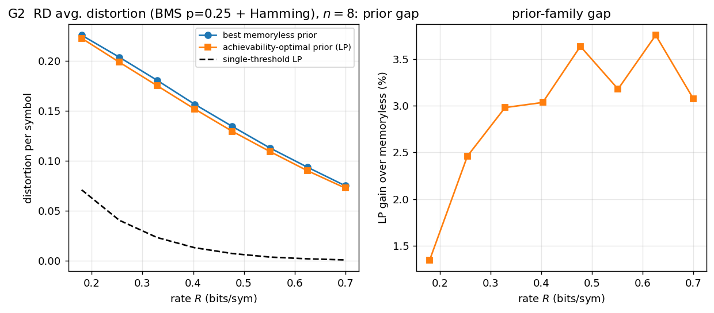
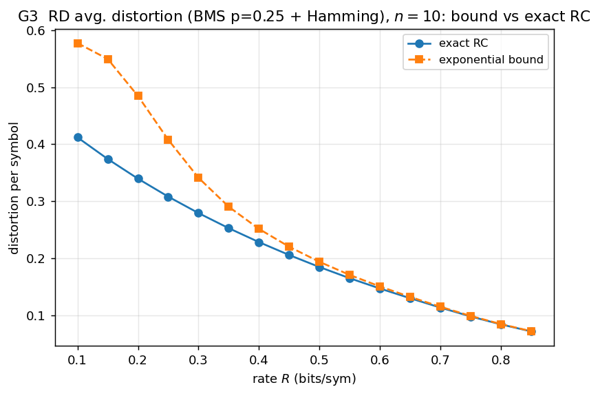
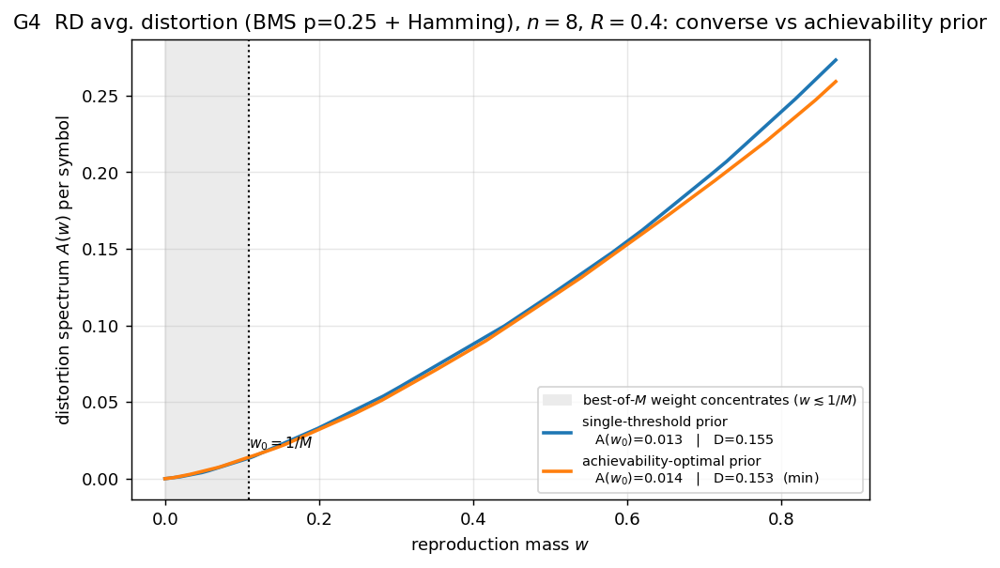
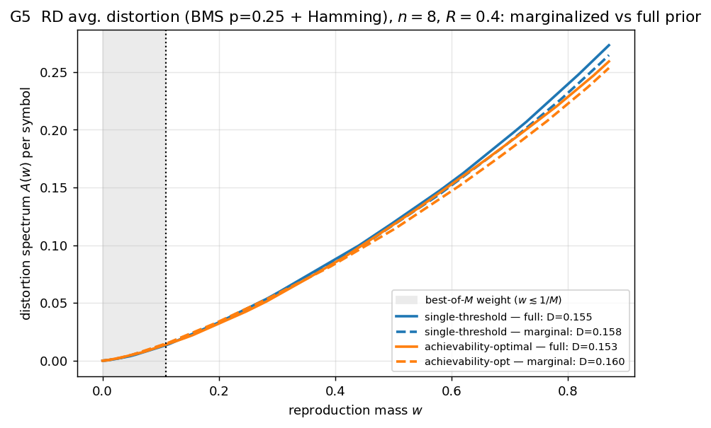

# Rate-distortion (average distortion) — results

Four figures for the binary memoryless source (bias `p=0.25`, **asymmetric** so a
prior gap exists) with Hamming distortion, generated by
[`examples/gen_rd_average.py`](../examples/gen_rd_average.py).

## G1 — Monte-Carlo spread vs the RCB expectation

60 random codebooks' realised distortion scatter around the analytic
random-coding (RCB) expectation; distortion decreases with rate.

## G2 — the prior gap

Achievability-optimal reproduction prior (bracketing LP) vs the best memoryless
prior, with the single-threshold LP (converse) below. The LP gain over the best
memoryless prior is **1.4–3.75 %** — the RD analogue of the channel's
constant-composition gain (small, like channel coding at this `n`).

## G3 — exact RC vs the exponential bound

The exact random-coding distortion vs the exponential surrogate; loose at low
rate, tightening as the rate grows.

## G4 — distortion spectrum: converse- vs achievability-optimal prior

The distortion spectra of the two optimal priors. Unlike channel coding (where
the two priors differ wildly), for average-distortion RD they are **nearly the
same** — the curves overlap, and the legend numbers show the small crossover:
single-threshold prior wins at the threshold (`A(w₀)=0.013 < 0.014`),
achievability-optimal prior wins on the integrated distortion (`D=0.153 < 0.155`).
The prior choice barely matters here.

## G5 — marginalize: the per-symbol marginal as a memoryless prior

Each optimal reproduction prior (solid) vs its i.i.d. per-symbol marginal (dashed)
— the classical recipe for a memoryless prior. The distortion spectra nearly
overlap: marginalization costs **+1.7 %** for the single-threshold prior and
**+4.4 %** for the achievability-optimal prior (`D=0.153 → 0.160`). As in the rest
of average-distortion RD, the prior structure barely matters — the marginal is an
excellent memoryless prior here.
