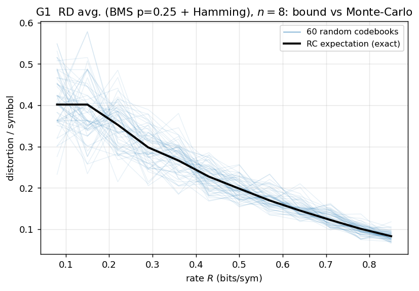
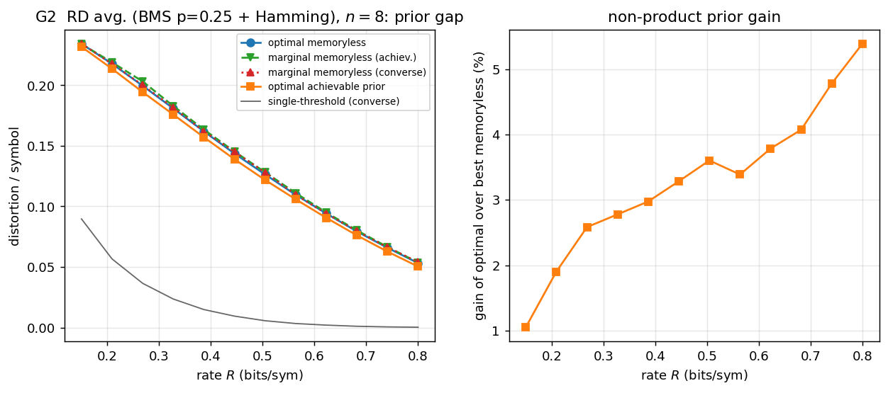
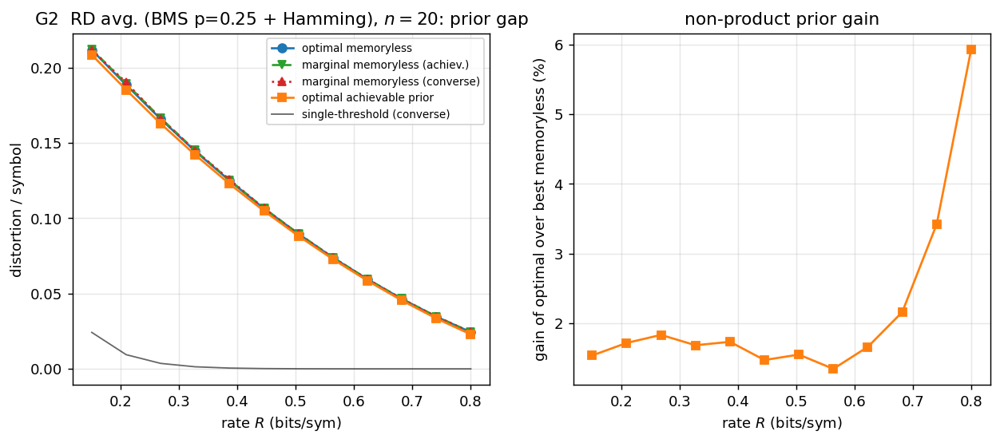
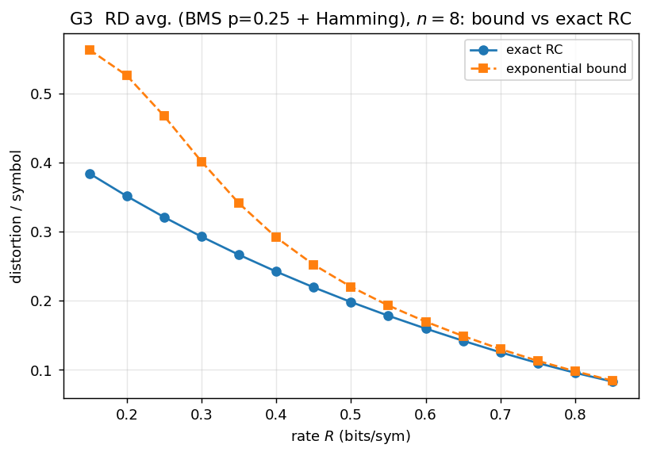
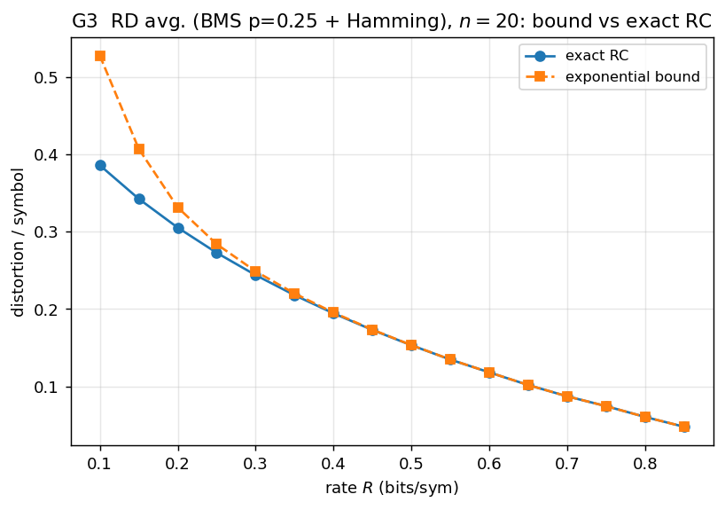
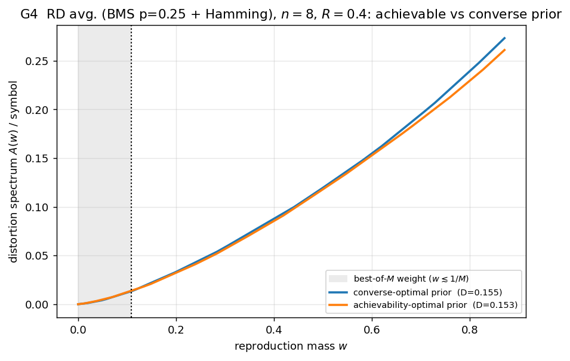
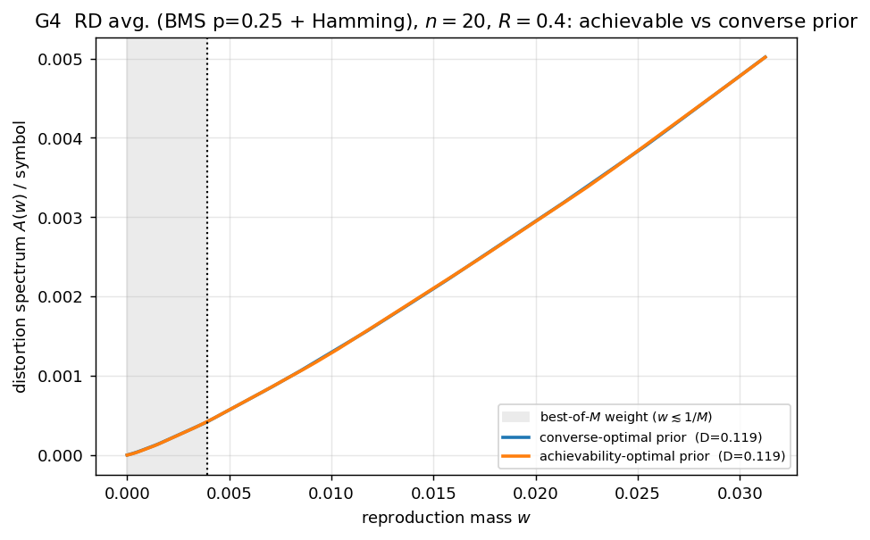
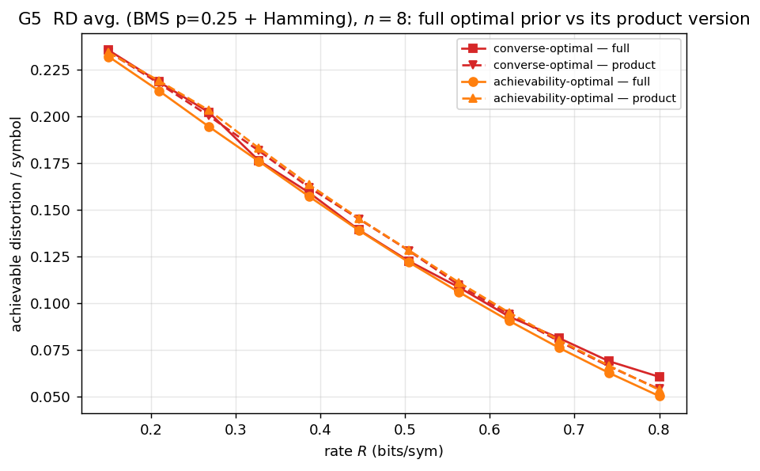
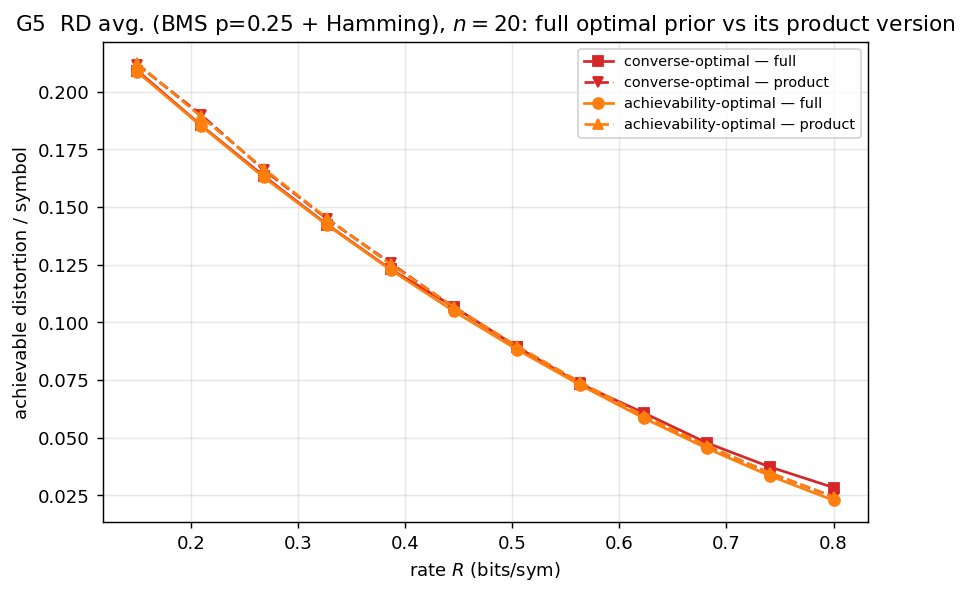

# Rate-distortion (average distortion) — results

Pinned case: **binary memoryless source, bias `p=0.25`** (asymmetric, so a prior
gap exists) with Hamming distortion. G1 validates the bound at `n=8`; G2–G4 are
shown at **`n=8` and `n=20`**. The achievability-optimal reproduction prior is the
Φ-view simplex march (exact best-of-`M` kernel). Generated by
[`examples/gen_rd_average.py`](../examples/gen_rd_average.py).

## G1 — bound vs Monte-Carlo (`n=8`)

60 random codebooks' realised per-symbol distortion scatter around the analytic
random-coding expectation.

## G2 — the prior gap (centerpiece)

| `n=8` | `n=20` |
|---|---|
|  |  |

Optimal achievable reproduction prior vs optimal memoryless and the two
marginal-memoryless priors (achievable / converse), all on the exact kernel. The
gain over the best memoryless prior is **≈5.4 % (`n=8`) / ≈5.9 % (`n=20`)**, largest
at high rate. The marginal-memoryless priors essentially coincide with the optimum
— for average distortion the prior structure barely matters, and the cheap marginal
recipe loses almost nothing.

## G3 — exact RC vs the exponential bound

| `n=8` | `n=20` |
|---|---|
|  |  |

Exact random-coding distortion vs the exponential surrogate; loose at low rate,
tightening as the rate grows.

## G4 — distortion spectrum: achievability- vs converse-optimal prior

| `n=8` | `n=20` |
|---|---|
|  |  |

The distortion spectra of the two optimal priors are **nearly identical** — unlike
channel coding (and excess distortion), reusing the converse prior for
achievability costs almost nothing here: `D = 0.1551 → 0.1529` at `n=8` (~1.4 %),
`0.1189 → 0.1186` at `n=20`. Average distortion is the prior-insensitive case.

## G5 — full optimal prior vs its product (marginalized) version

| `n=8` | `n=20` |
|---|---|
|  |  |

Each optimal prior vs its i.i.d. product version, scored by the exact best-of-`M`
distortion. **All four curves nearly coincide** — for average distortion the prior
is insensitive, so the product (marginalized) version costs essentially nothing and
the converse and achievability priors are interchangeable. This is the honest
contrast to channel coding (where the converse-full curve sits far above).
