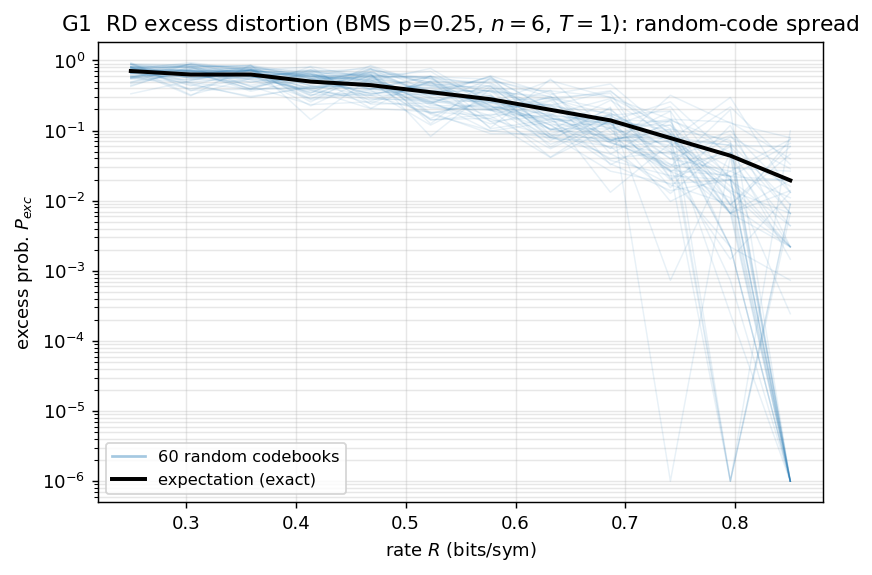
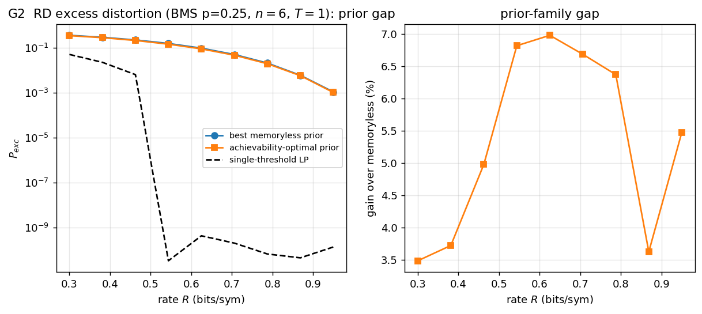
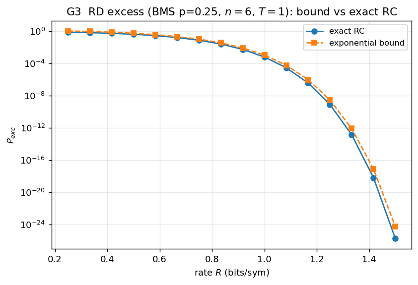
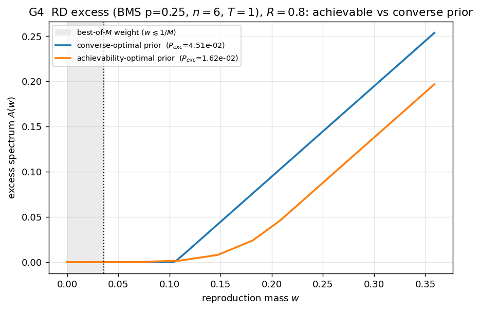
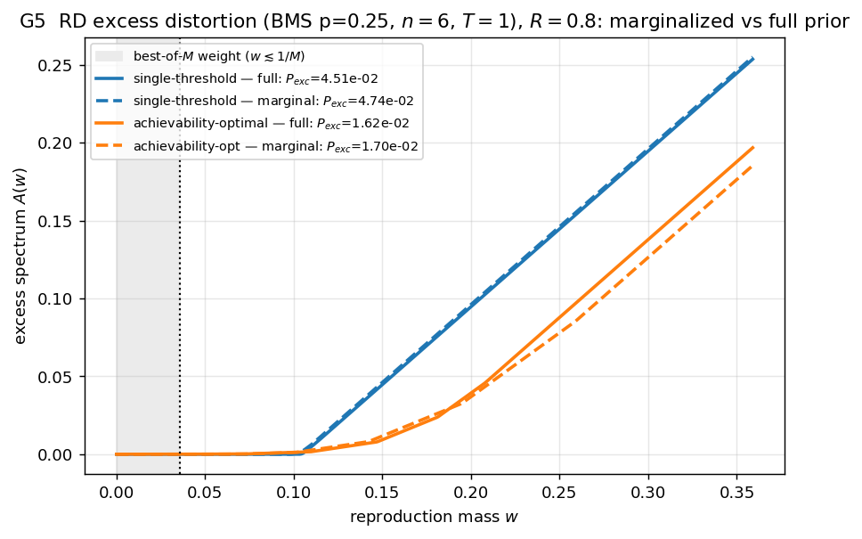

# Rate-distortion (excess distortion) — results

Four figures for the **excess-distortion probability** `P_exc = Pr[d > T]` of a
binary memoryless source (`p=0.25`) with block-Hamming distortion, threshold
`T=1`, generated by [`examples/gen_rd_excess.py`](../examples/gen_rd_excess.py).

Excess distortion is the best-of-M of the **block-distortion indicator**
`d_exc = 1{block-Hamming > T}`, so it is the ordinary lossy-coding machinery
applied to a 0/1 distortion. We compute it exactly in the lifted `X^n` space at
small `n` (the repo's per-letter `ExcessRD` is degenerate for binary Hamming;
this is the correct block-excess quantity, cf. Kostina–Verdú).

## G1 — Monte-Carlo spread vs the expectation

60 random codebooks' realised `P_exc` around the exact expectation. (Capped to the
rate range where Monte-Carlo can still estimate the event — beyond it, a single
codebook almost always achieves `P_exc = 0`, which MC cannot distinguish from a
small positive probability.)

## G2 — the prior gap

Achievability-optimal vs best memoryless reproduction prior, with the
single-threshold LP (converse) below. The gain over the best memoryless prior is
**~3.5–7 %** — somewhat larger than the average-distortion case, as a probability
is more prior-sensitive than a mean. (The converse LP floors at the solver's
feasibility limit ~1e-10; the rate range is capped to keep it meaningful.)

## G3 — exact RC vs the exponential bound

Exact `P_exc` vs the exponential surrogate, both on a log scale; the bound tracks
closely and slightly above.

## G4 — excess spectrum: converse- vs achievability-optimal prior

The strongest excess figure: the converse-optimal prior's excess spectrum sits
clearly **above** the achievability-optimal one. Reused for achievability, the
converse prior gives **`P_exc = 4.5e-2` vs the optimal `1.6e-2` — 2.8× worse**.
As in channel coding (and unlike average-distortion RD), the converse and
achievability priors are genuinely different for excess distortion.

## G5 — marginalize: the per-symbol marginal as a memoryless prior

Each optimal reproduction prior (solid) vs its i.i.d. per-symbol marginal (dashed).
Unlike the spectra of the two *different* priors (which separate clearly — the
converse prior sits well above the achievability one), **each prior's marginal
tracks its own full version closely**: marginalization costs only **+5.1 %**
(single-threshold, `P_exc = 4.5e-2 → 4.7e-2`) and **+4.9 %** (achievability,
`1.6e-2 → 1.7e-2`). So even where the prior *family* matters a lot (the 2.8×
converse-vs-achievability gap), going from the full type prior to its i.i.d.
marginal costs little — the marginal is a good memoryless prior.
