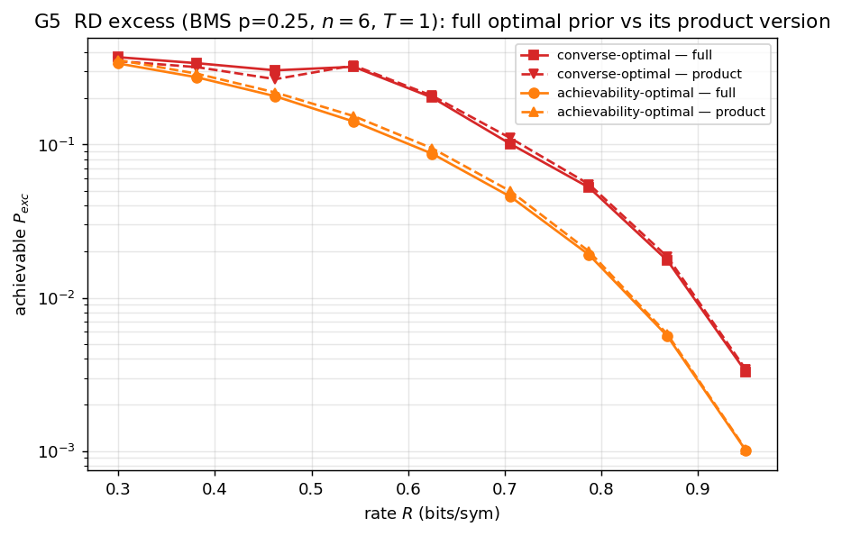

# Rate-distortion (excess distortion) — results

Pinned case: **binary memoryless source `p=0.25`**, block-Hamming distortion,
threshold **`T=1`**, **`n=6`**. Excess distortion is the best-of-`M` of the block
indicator `d_exc = 1{block-Hamming > 1}`, a *lifted* `Y^n` quantity (the per-letter
indicator is degenerate), so all figures stay at `n=6` — which also keeps the
rare-event Monte-Carlo (G1) estimable. Generated by
[`examples/gen_rd_excess.py`](../examples/gen_rd_excess.py).

## G1 — bound vs Monte-Carlo

60 random codebooks' realised `P_exc` around the exact expectation (rate range
capped to where MC can still estimate the event).

## G2 — the prior gap (centerpiece)

Optimal achievable reproduction prior vs optimal memoryless and the two
marginal-memoryless priors. The gain over the best memoryless prior peaks at
**≈7 %** (mid-rate) — the largest of the three use cases, since a probability is
more prior-sensitive than a mean. The **converse-marginal** (red) is visibly the
worst memoryless prior: marginalizing the converse prior is a poor recipe for
excess, unlike the achievable-marginal which tracks the optimum.

## G3 — exact `P_exc` vs the exponential bound

Exact `P_exc` vs the exponential surrogate (log scale); the bound tracks closely
and slightly above.

## G4 — excess spectrum: achievability- vs converse-optimal prior

The converse-optimal prior's excess spectrum sits clearly **above** the
achievability-optimal one. Reused for achievability, the converse prior gives
**`P_exc = 4.5e-2` vs the optimal `1.6e-2` — 2.8× worse**. As in channel coding
(and unlike average distortion), the converse and achievability priors are
genuinely different for excess distortion.

## G5 — full optimal prior vs its product (marginalized) version

Each optimal prior vs its i.i.d. product version, on the exact excess probability.
The **converse pair sits ~2.8× above the achievable pair** across rates — and,
unlike channel coding, **marginalizing the converse prior does *not* rescue it**
(its full and product curves overlap). Excess distortion is the case where the
converse prior is a poor achievability prior even after marginalization; the
achievability-optimal prior, full or product, stays at the bottom.
